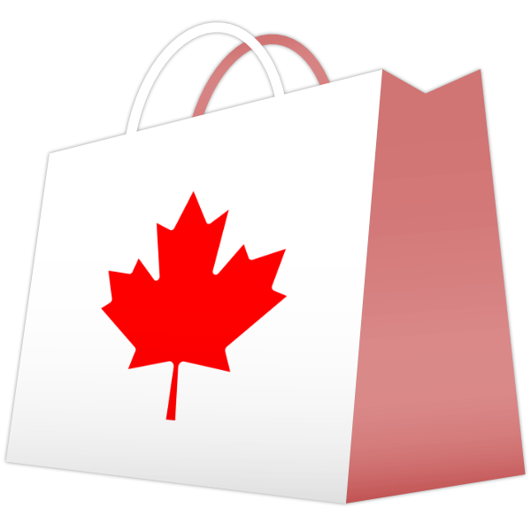
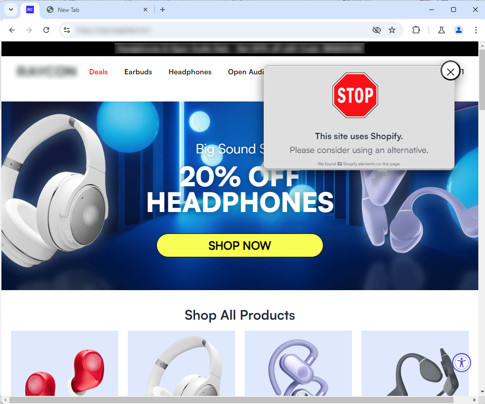
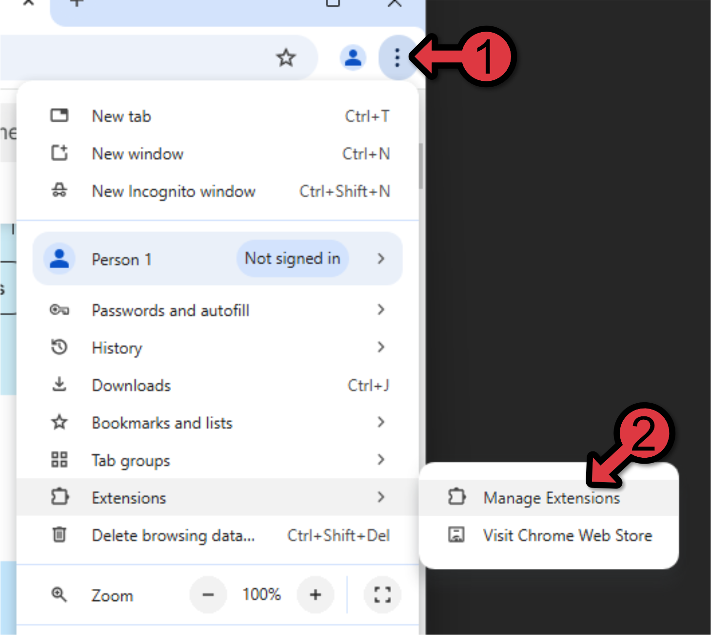
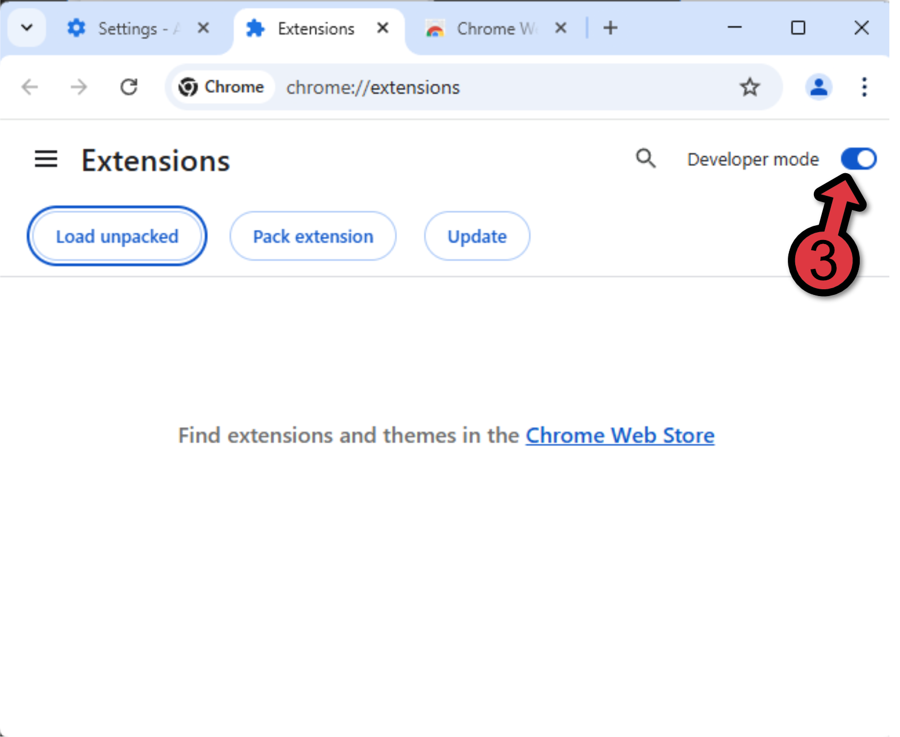
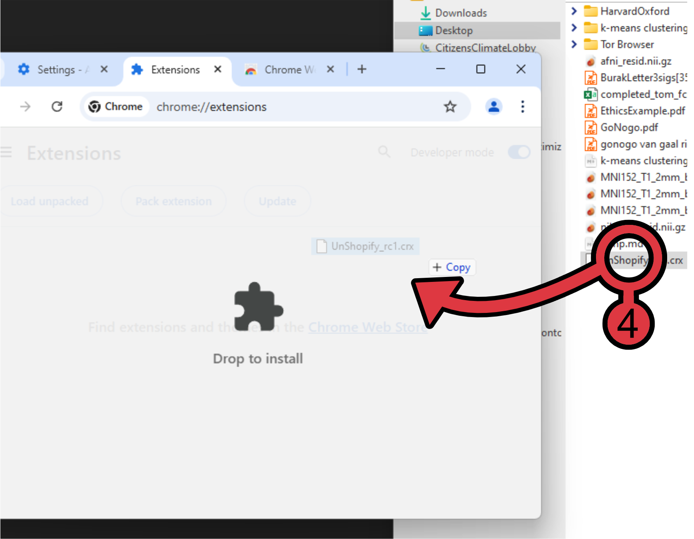

# Welcome to the Unshopify extension repo

## Table of Contents

- [Our Mission](#Our Mission)
  - [Why Shopify](#Why Shopify)
- [Should I not purchase from any site that uses Shopify?]([Should I not purchase from any site that uses Shopify?])
- [Installation]([Installation])

# Our Mission

|  |
| :----------------------------------------------------------: |
|         Say "no" to traitors. And skip the "sorry."          |

Canada's sovereignty has been threatened by US President Donald Trump, who seeks to annex us and absorb us as a US state. He's using economic coercion to force our hand. This extension aims to help us resist by using the only power we have these oligarchs actually care about: our money.

**Unshopify** gives online shoppers the knowledge to avoid giving any more money to those who would use it against us; namely, the executives at Shopify. 

Note that Unshopify does not block any sites or purchases. It merely lets you know which sites use Shopify.

|  |
| :----------------------------: |
|   Example screenshot (RC 1)    |

## Why Shopify?

Despite being a Canadian company, Shopify executives like Tobias Lütke, Daniel Debow, and Kaz Nejatian [have repeatedly defended Trump's economic attack on our country](https://nypost.com/2025/02/02/us-news/shopify-ceo-defends-trump-tariff-demands-slams-trudeau/) and downplayed the calls for annexation. Canada is not without our own tech bro oligarchs, and it seems like ours are just as undemocratic and treacherous as those to the South. And they're collaborating with each other in a Project 2025-style attempt to exploit us for even more wealth, and are using the [Conservative party and Pierre Poilievre](https://breachmedia.ca/canada-far-right-tech-billionaires-pierre-poilievre/) to do it. The Logic has a fantastic [article](https://thelogic.co/news/the-big-read/canada-tech-pierre-poilievre/?lt=1) about this, or you can watch the coverage of it from independent Canadian journalist [Rachel Gilmore](https://youtu.be/9SUZLC0QoIs).

While there are others we should worry about, I decided to focus my early efforts on Shopify since they're one of the largest businesses in Canada.

# Should I not purchase from any site that uses Shopify?

This is where things get complicated. While Shopify sucks, a lot of small businesses still rely on them. And right now it is more important than ever to support small Canadian businesses. Consider avoiding bigger companies since they probably don't need any more of your money, and try paying smaller businesses using alternative means. Some may accept e-transfer payments if you call/email them with your order details. And shopping in person means you don't need any Shopify at all. **But it's your choice.** The extension  is just to help consumers make the best and most informed decision for them. 

# Installation

The extension can either be installed via the Chrome Web Store (currently awaiting approval) or by downloading and installing the \*.crx file from the Releases section of this repo and following the instructions below. These same instructions should work on any other Chromium-based browser (e.g., Microsoft Edge, Brave, Opera, Vivaldi, etc).

|  |  |  |
| ------------------------------------------------------------ | ------------------------------------------------------------ | ------------------------------------------------------------ |
| From the dropdown menu, go down to Extensions > Manage Extensions | From there, make sure you enable Developer mode. This will allow you to install extensions from other sources. | Once that's done, you can simply drag and drop the most recent version of the extension into your browser window to install. |

And that's it! Happy shopping! 